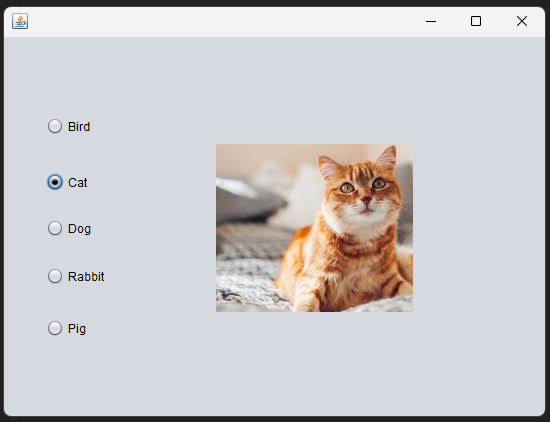

# Java Radio Button Group Selector

This Java Swing application allows users to select a type of pet using radio buttons. Based on the selected option, an image of the corresponding pet is displayed, and a message box shows the pet name.

## 🧑‍🏫 Assignment Requirement

- Create a GUI application using 5 radio buttons.
- Show the selected pet's image.
- Display the selection in a message box.
- Use NetBeans IDE (Version 25 in this case).
- Upload source code and screenshots to GitHub.

## 🖼️ Application Output

Below is a screenshot of the application at runtime with the "Cat" option selected:

